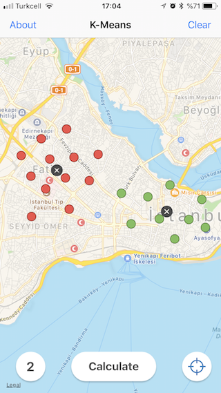

# K-Means-Mapkit (K-Ortalamalar)

  

This repository includes usage of KMeans algorithm on MapKit Library
----------------

## Kullanımı (Usage)

Harita üzerinde basılı tutarak noktaları atın. Hesapla butonuna dokunun. Hesaplama tamamlandığında noktalar farklı renklerde kümelenecektir.

## Hakkında (About)

YTÜ Harita Mühendisliği, "Mekansal İstatistik" doktora dersi proje uygulamasıdır. K-Means (K-Ortalamalar) Kümeleme algoritamasının Apple haritalarında mekansal olarak kullanımını gösteren bir mobil (iOS) uygulama geliştirilmiştir. 

Harita Yüksek Müh. Furkan ÖZOĞLU 
Dr.Öğr.Üyesi Alper ŞEN 

## Kaynaklar (Resources)

[sdq](https://github.com/sdq/deepvis) -> KMeans.swift is used. Thanks.
